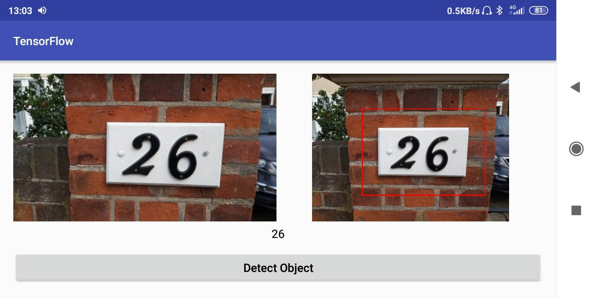

# UDACITY CAPSTONE Deep learning project

## Problem statement

In this capstone project the objective is to develop a deep learning Android app to decode sequences of digits from natural images. For this we use the Street View House numbers (SVHN) dataset, which is a real-world collection of images obtained from Google Street View Images, to train deep learning models within the app.

## Application architecture

In this project to recognize numbers, the images app uses detection and classification convolution neural network (CNN) models. 
The app detection and classification pipeline:
1.    Get input image (taken by phone camera)
2.    Resize an image to 64x48x3 and then normalize it
3.    Feed processed image into detection CNN to get bounding box coordinates
4.    Calculate bounding box coordinates in the original image and display image with bounding box on the app 
5.    Cut the bounding box area with additional margin and resize to 54x54x3 
6.    Feed the cut image to classification CNN to get number of digits and digits predictions 
7.    Display number prediction on the app 

## Application user interface

App has a very simple user interface that has four parts:
+ **Camera stream** on the left side of the app
+ **Button** at bottom of the app to take an image
+ **Image view** on the right side of the to show taken image with predicted number's bounding box
+ **Text view** below image view and camera stream to show predicted model results

## Files

+ [*1__Preproccess.ipynb*](1__Preproccess.ipynb) - reads, explores and preproccess raw the SVHN dataset 
+ [*2__Classifier_datasets.ipynb*](2__Classifier_datasets.ipynb) - prepares testing, validation and augmented training dataset for sequences of digits CNN classifier
+ [*3__Classifier.ipynb*](3__Classifier.ipynb) - defines and trains CNN calssifier that decodes sequences of digits. In the of notebook there are classifier error analysis and final TensorFlow model convertion into tflite model 
+ [*4__Object_detection_dataset.ipynb*](4__Object_detection_dataset.ipynb) - prepares testing, validation and augmented training dataset for CNN model which predicts number's bounding box
+ [*5__Regression_model.ipynb*](5__Regression_model.ipynb) - defines and trains CNN regression model which predicts number bounding box coordinates. In the end of notebook there are classifier error analysis and final TensorFlow model convertion into tflite model 
+ [*6__Approach.ipynb*](6__Approach.ipynb) - executes full approach pipeline - from raw image to the number prediction.

## Results 

Developed two CNN approach localizes and classifies up to three digits number in the given image. Regression CNN localizes numbers bounding box with 80.86% IoU (Intersection over Union), classification CNN classifies digits in the number with 94.26% accuracy, whole number - with 87.03% accuracy on test data. The whole approach number's classification accuracy is 83.82%.

